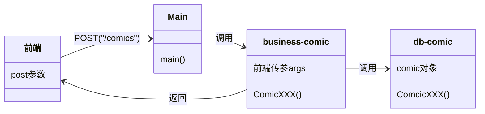
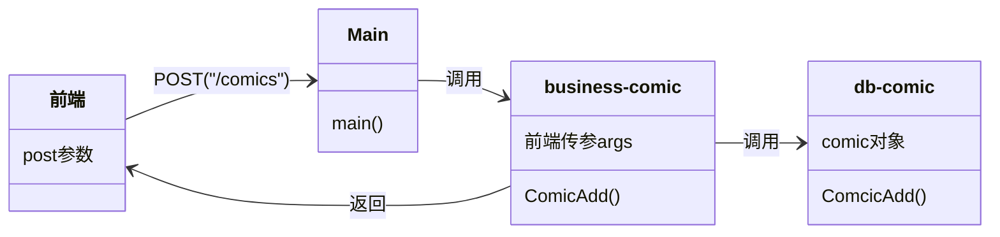
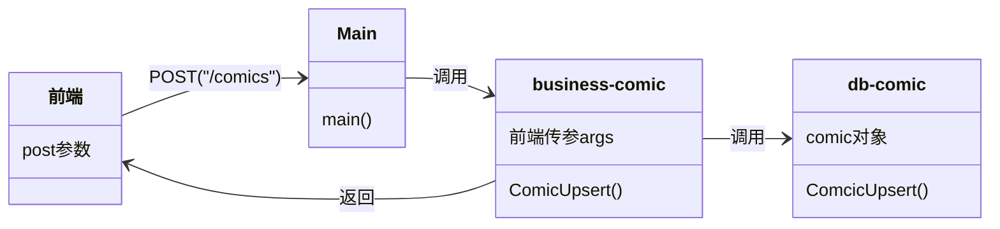
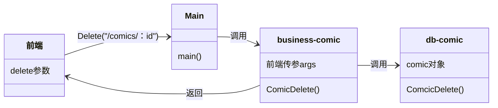
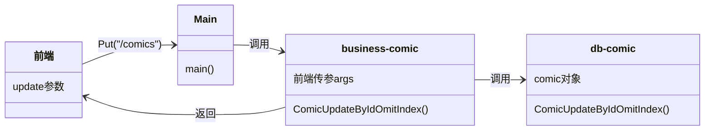

# 漫画逻辑图
对应文件：
- `business/comic/comic.go`

## 主要作用

```mermaid
flowchart TB
  实现API接口服务  
```

## 简易流程图

```mermaid
flowchart LR
  A[前端] -- 请求 --> main.go --> business/comic函数 --> db/comic函数 --> 返回 --> A
```

## 通用流程图

```mermaid

classDiagram
direction LR

class 前端 {
    post参数
}
class Main {
    main()
}
class business-comic {
    前端传参args
    ComicXXX()
}

class db-comic {
    comic对象
    ComcicXXX()
}

前端 --> Main : POST("/comics")
Main --> business-comic : 调用
business-comic -->  db-comic : 调用

%% 接口返回
business-comic --> 前端 : 返回

```

## 有哪些函数

```mermaid
flowchart TB
  ComicAdd
  ComicDelete
  ComicUpdate
  ComicUpdateByIdOmitIndex
  ComicQuery
  ComicQueryByPage
```

## 具体函数作用
没写

## 各函数实现 - 接口
### 增

```mermaid
classDiagram
direction LR

class 前端 {
    post参数
}
class Main {
    main()
}
class business-comic {
    前端传参args
    ComicAdd()
}

class db-comic {
    comic对象
    ComcicAdd()
}

前端 --> Main : POST("/comics")
Main --> business-comic : 调用
business-comic -->  db-comic : 调用

%% 接口返回
business-comic --> 前端 : 返回
```

### 增 或者更新 upsert

```mermaid
classDiagram
direction LR

class 前端 {
    post参数
}
class Main {
    main()
}
class business-comic {
    前端传参args
    ComicUpsert()
}

class db-comic {
    comic对象
    ComcicUpsert()
}

前端 --> Main : POST("/comics")
Main --> business-comic : 调用
business-comic -->  db-comic : 调用

%% 接口返回
business-comic --> 前端 : 返回
```

### 删

```mermaid
classDiagram
direction LR

class 前端 {
    delete参数
}
class Main {
    main()
}
class business-comic {
    前端传参args
    ComicDelete()
}

class db-comic {
    comic对象
    ComcicDelete()
}

前端 --> Main : Delete("/comics/：id")
Main --> business-comic : 调用
business-comic -->  db-comic : 调用

%% 接口返回
business-comic --> 前端 : 返回
```

### 改

```mermaid
classDiagram
direction LR

class 前端 {
    update参数
}
class Main {
    main()
}
class business-comic {
    前端传参args
    ComicUpdateByIdOmitIndex()
}

class db-comic {
    comic对象
    ComicUpdateByIdOmitIndex()
}

前端 --> Main : Put("/comics")
Main --> business-comic : 调用
business-comic -->  db-comic : 调用

%% 接口返回
business-comic --> 前端 : 返回
```