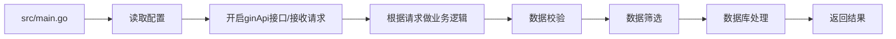
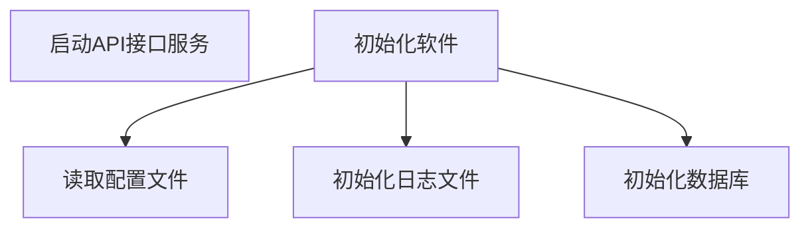
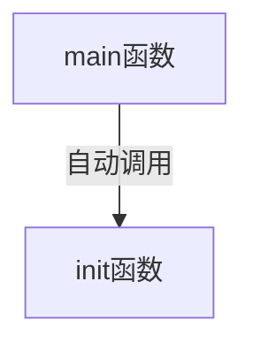
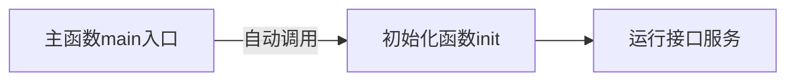
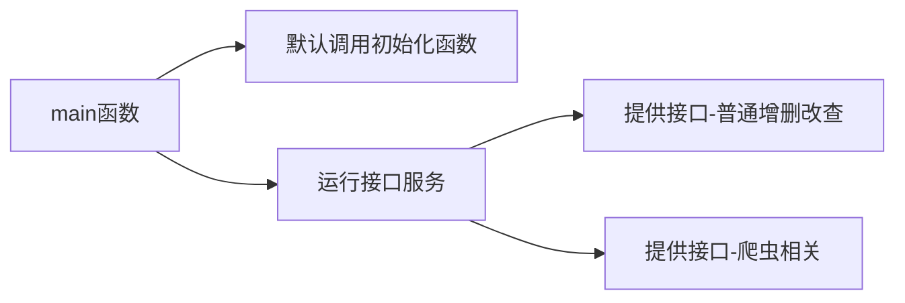
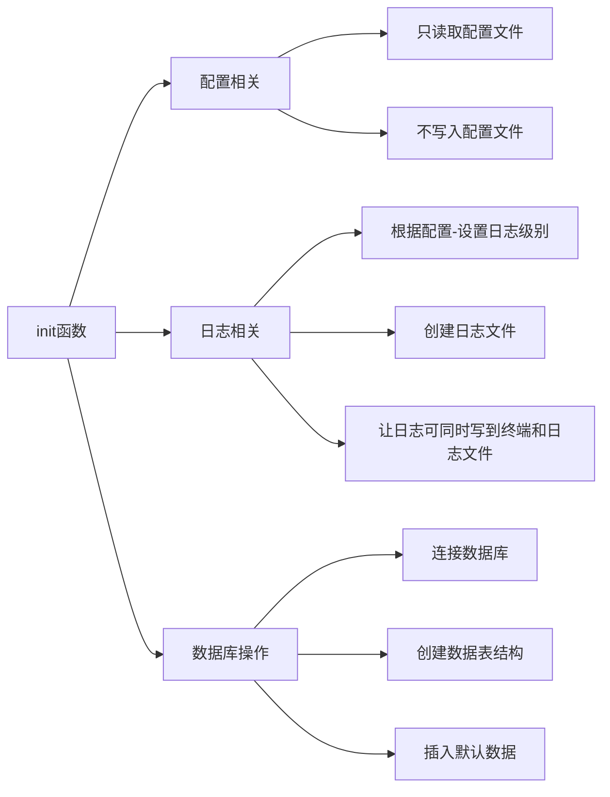

# 简易流程图

```mermaid
flowchart LR
  A[src/main.go] --> 读取配置 --> 开启ginApi接口/接收请求 --> 根据请求做业务逻辑 --> 数据校验 --> 数据筛选 --> 数据库处理 --> 返回结果
  

```

# main.go 逻辑

## 主要作用

```mermaid
flowchart TB
  启动API接口服务
  A[初始化软件]
  A --> 读取配置文件
  A --> 初始化日志文件
  A --> 初始化数据库
  
  
```

## 有哪些函数

```mermaid
flowchart TB
  A[main函数] --自动调用 -->B[init函数]
  
```

## 逻辑

```mermaid
flowchart LR
  A[主函数main入口] --自动调用 -->B[初始化函数init] --> 运行接口服务
  
```

## 具体函数的作用
### main函数作用

```mermaid
flowchart LR
  A[main函数] --> A1[默认调用初始化函数]
  A --> A2[运行接口服务]

  A2 --> A11[提供接口-普通增删改查]
  A2 --> A12[提供接口-爬虫相关]
  
```

### init 函数作用

```mermaid
flowchart LR
  A[init函数] --> A1[配置相关] 
  A1 --> 只读取配置文件 
  A1 --> 不写入配置文件
  
  A --> A2[日志相关]
  A2 --> 根据配置-设置日志级别
  A2 --> 创建日志文件
  A2 --> 让日志可同时写到终端和日志文件
  
  A --> A3[数据库操作]
  A3 --> 连接数据库
  A3 --> 创建数据表结构
  A3 --> 插入默认数据
  
```