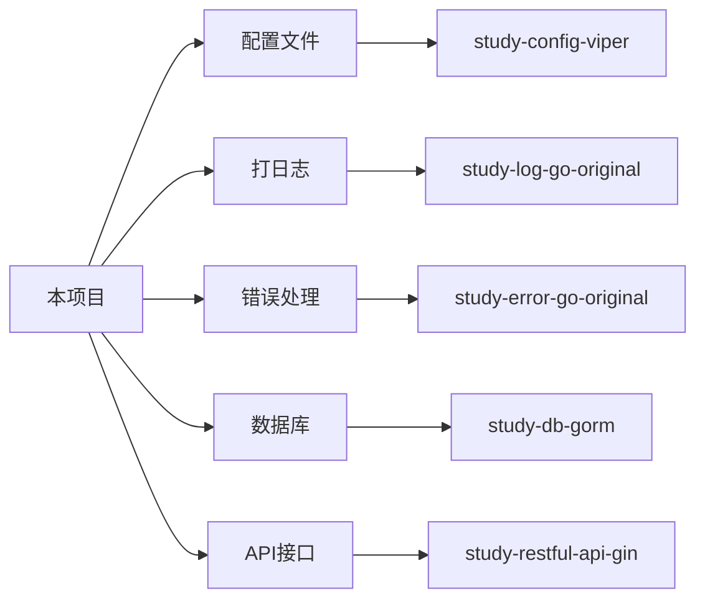

# 用途：显示调用哪些其他github项目

# 流程图

```mermaid
flowchart LR
  A[本项目] --> B[配置文件] --> study-config-viper
  A --> C[打日志] --> study-log-go-original
  A --> D[错误处理] --> study-error-go-original
  A --> E[数据库] --> study-db-gorm
  A --> F[API接口] --> study-restful-api-gin
  

```