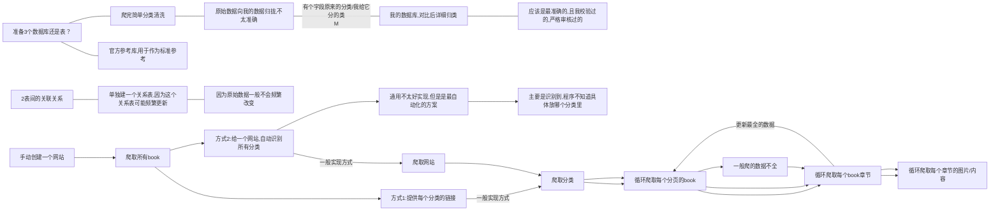

爬book类的网站，适用于：漫画、小说、有声书、视频

```mermaid
flowchart LR

M[准备3个数据库还是表？] 
M --- 爬完简单分类清洗 --- 原始数据向我的数据归拢,不太准确 -- 有个字段原来的分类/我给它分的类
M --- 我的数据库,对比后详细归类 --- 应该是最准确的,且我校验过的,严格审核过的
M --- 官方参考库,用于作为标准参考

2表间的关联关系 --- 单独建一个关系表,因为这个关系表可能频繁更新 --- 因为原始数据一般不会频繁改变


A[手动创建一个网站] --> B[爬取所有book]
B --> C1[方式1:提供每个分类的链接]
B --> C2[方式2:给一个网站,自动识别所有分类] --> 通用不太好实现,但是是最自动化的方案 --> 主要是识别到,程序不知道具体放哪个分类里

C1 -- 一般实现方式 --> 爬取分类 --> 循环爬取每个分页的book --> 循环爬取每个book章节 --> 循环爬取每个章节的图片/内容
C2 -- 一般实现方式 --> 爬取网站 --> 爬取分类 --> 循环爬取每个分页的book --> 循环爬取每个book章节 --> 循环爬取每个章节的图片/内容

循环爬取每个分页的book --> 一般爬的数据不全 --> 循环爬取每个book章节 -- 更新最全的数据 --> 循环爬取每个分页的book
```
